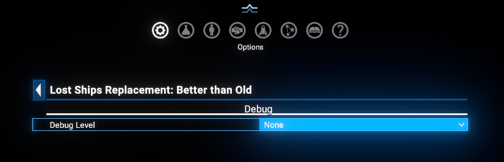

# Lost Ships Replacement - Better than Old

Get a better ship back than the one you lost. Save a loadout named `ReplacementShip` for a ship model in any shipyard, and from then on every `Lost Ships Replacement` request for that model is ordered with that loadout. There is nothing else to set up - no per-ship, per-fleet or per-order configuration.

`Lost Ships Replacement` is the vanilla feature introduced in X4: Foundations `7.50` - when a fleet ship is lost while carrying out an order, the fleet automatically requests a new one, an exact copy of the ship it lost, loadout included. This extension changes only the loadout of that request.

## Compatibility

This extension is compatible with X4: Foundations version `7.50` and newer.

On version `9.00` and newer the better loadout is applied before the replacement is built, so the ship is priced and produced like any other order. On earlier versions the loadout is applied to the finished ship rebuild instead, at no cost.

## Requirements

- `X4: Foundations` 8.00 and 9.00 and newer. For versions 7.50 and 7.60 use the version 1.00 of this extension.
- `Mod Support APIs` by [SirNukes](https://next.nexusmods.com/profile/sirnukes?gameId=2659) to be installed and enabled. Version `1.95` and upper is required.
  - It is available via Steam - [SirNukes Mod Support APIs](https://steamcommunity.com/sharedfiles/filedetails/?id=2042901274)
  - Or via the Nexus Mods - [Mod Support APIs](https://www.nexusmods.com/x4foundations/mods/503)
- `Options Helper`, to provide the in-game Debug Level option. Version `1.10` and upper is required.
  - It is available via Steam - [Options Helper](https://steamcommunity.com/sharedfiles/filedetails/?id=3715253556)
  - Or via the Nexus Mods - [Options Helper](https://www.nexusmods.com/x4foundations/mods/2089)
- `Print Extension List`, to record the game version and the enabled extensions in the log. Version `1.01` and upper is required.
  - It is available via Steam - [Print Extension List](https://steamcommunity.com/sharedfiles/filedetails/?id=3770927339)
  - Or via the Nexus Mods - [Print Extension List](https://www.nexusmods.com/x4foundations/mods/2191)

## Limitations

This mod requires a `Protected UI Mode` in the Extensions settings to be disabled.
For game versions 8.0 and below, if the shipyard selected to produce the replacement ship does not have the required resources for the better one - you will get the "old" one.

## Download

You can download the latest version via - [Steam client](https://steamcommunity.com/sharedfiles/filedetails/?id=3447300452)
Or you can do it via [Nexus Mods](https://www.nexusmods.com/x4foundations/mods/1661)

## Usage

Simply install the extension and play as usual.
Only one, but important, thing - please save the required loadout for any ship model with name 'ReplacementShip' in the shipyard.
Nothing more is required.

And mod will try to provide the better replacement ship for you.

## Extension Options

The mod adds a `Lost Ships Replacement: Better than Old` page to `Settings` - `Extensions Options`, with a single setting:

- **Debug Level** - how much the mod writes to the game log. `None` is the default and keeps the log clean, `Debug` records one line per action taken, and `Trace` adds the per-ship and per-loadout detail. Use `Debug` or `Trace` when preparing a bug report, then set it back to `None`.

The setting takes effect immediately, no reload needed.

## Videos

[X4 Foundations: Lost Ship Replacement - Better than Old version 1.00](https://www.youtube.com/watch?v=DFVexbenitI)
[X4 Foundations: Lost Ship Replacement - Better than Old version 2.00](https://www.youtube.com/watch?v=Qt8EEfEeik4)

## Credits

- **Author**: Chem O`Dun, on [Nexus Mods](https://next.nexusmods.com/profile/ChemODun/mods?gameId=2659) and [Steam Workshop](https://steamcommunity.com/id/chemodun/myworkshopfiles/?appid=392160)
- *"X4: Foundations"* is a trademark of [Egosoft](https://www.egosoft.com).

## Acknowledgements

- [EGOSOFT](https://www.egosoft.com) — for the X series.
- [SirNukes](https://next.nexusmods.com/profile/sirnukes?gameId=2659) — for the `Mod Support APIs` that power the UI hooks.

## Changelog

### [2.00] - 2026-08-06

- **Improved**
  - Support for X4 9.00: the replacement is now ordered with the `ReplacementShip` loadout already in place, so it is priced and built like a normal order. On earlier game versions the previous behaviour is kept.
- **Added**
  - `Extensions Options` page with a `Debug Level` setting - `None`, `Debug` or `Trace`.

### [1.00] - 2025-03-18

- **Added**
  - Initial release.
